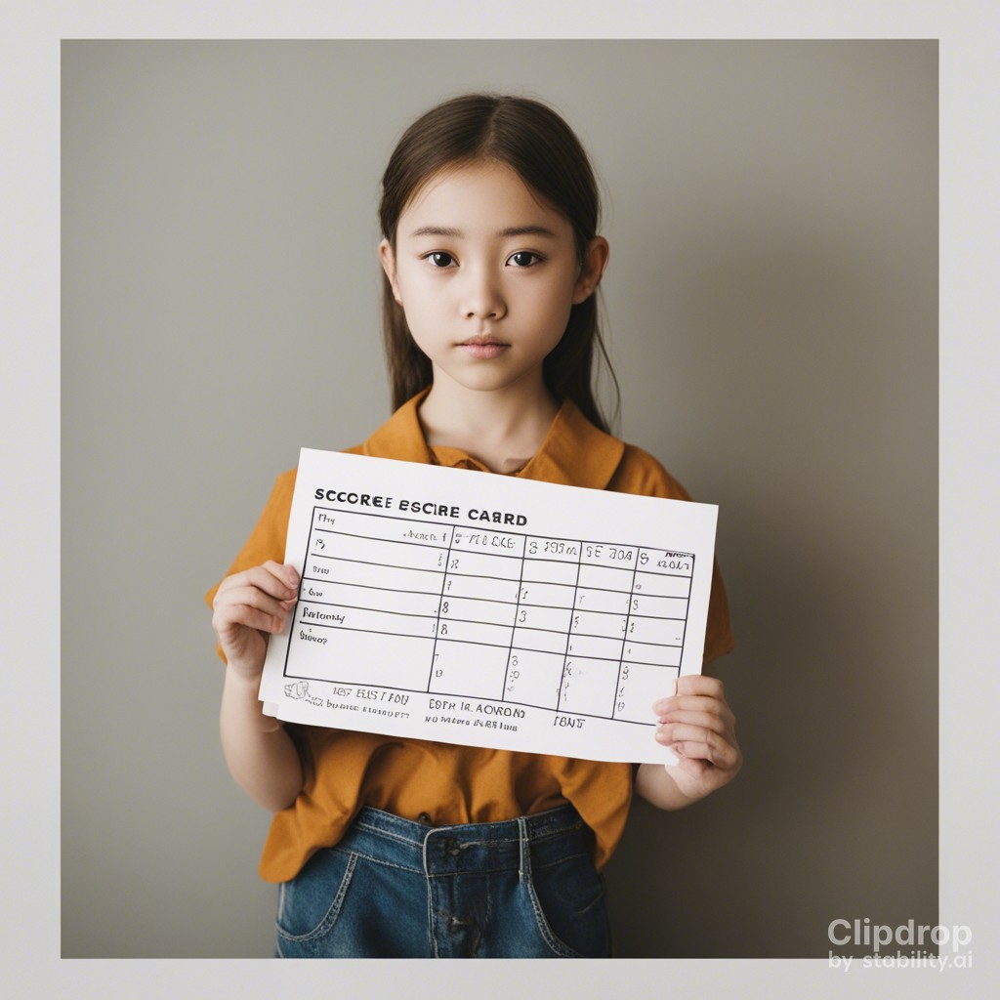

# Student-Result-Analysis
The project focuses on exploring and visualizing various aspects of student performance, including factors like gender, parental education, marital status, and ethnic group



## Contents

- [Getting Started](#getting-started)
- [Data Overview](#data-overview)
- [Data Cleaning](#data-cleaning)
- [Exploratory Data Analysis](#exploratory-data-analysis)
- [Outlier Detection](#outlier-detection)
- [Ethnic Group Distribution](#ethnic-group-distribution)
- [Numerical Column Distribution](#numerical-column-distribution)
- [Contributing](#contributing)

## Getting Started

To run the analysis, you'll need the following libraries:

```
import pandas as pd
import numpy as np
import matplotlib.pyplot as plt
import seaborn as sns
```

You'll also need to load the dataset, which should be stored in a CSV file named "Expanded_data_with_more_features.csv."

## Data Overview

The dataset contains information about students, including their gender, ethnic group, parental education, lunch type, test preparation, parental marital status, practice of sports, and more. It also includes scores in math, reading, and writing.

## Data Cleaning

The analysis begins with data cleaning to handle missing values and remove unnecessary columns. The "Unnamed: 0" column is dropped, and missing values in various columns are addressed.

## Exploratory Data Analysis

- Gender Distribution: Visualizes the distribution of students by gender.
- Parental Education: Analyzes the relationship between students' scores and their parents' education levels.
- Parental Marital Status: Examines the correlation between students' scores and their parents' marital status.

## Outlier Detection

Detects outliers in math, reading, and writing scores using box plots.

## Ethnic Group Distribution

- Calculates the number of students in each ethnic group (Group A, Group B, Group C, Group D, Group E).
- Visualizes the distribution of students in different ethnic groups using a pie chart and bar plot.

## Numerical Column Distribution

Visualizes the distribution of numerical columns (math score, reading score, writing score) using violin plots.

## Contributing

Contributions and feedback are welcome. If you have ideas for improving the analysis or adding new features, feel free to create pull requests or open issues.
